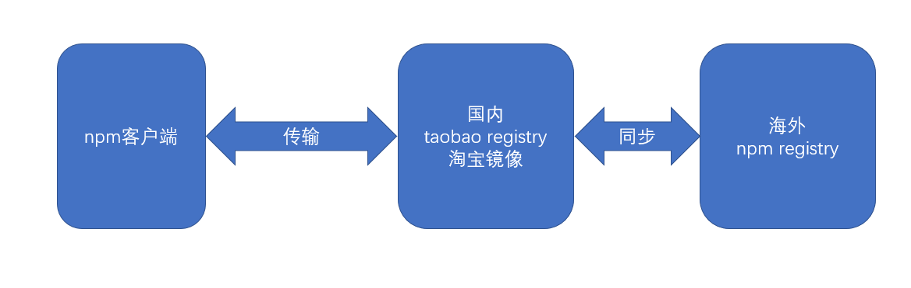

# 包的安装

> 安装（install）即下载包
> 由于 npm 的官方 registry 服务器位于国外，可能受网速影响导致下载缓慢或失败。因此，安装好 npm 之后，需要重新设置 registry 的地址为国内地址。目前，淘宝 https://registry.npm.taobao.org 提供了国内的 registry 地址，先设置到该地址。设置方式为```npm config set registry https://registry.npm.taobao.org```。设置好后，通过命令```npm config get registry```进行检查
> 

npm 安装一个包，分为两种安装方式：

1. 本地安装
2. 全局安装


## 本地安装

使用命令```npm install 包名```或```npm i 包名```即可完成本地安装

本地安装的包出现在当前目录下的```node_modules```目录中

> 随着开发的进展，```node_modules```目录会变得异常庞大，目录下的内容不适合直接传输到生产环境，因此通常使用```.gitignore```文件忽略该目录中的内容
> 本地安装适用于绝大部分的包，它会在当前目录及其子目录中发挥作用
> 通常在项目的根目录中使用本地安装
> 安装一个包的时候，npm 会自动管理依赖，它会下载该包的依赖包到```node_modules```目录中
> 如果本地安装的包带有 CLI，npm 会将它的 CLI 脚本文件放置到```node_modules/.bin```下，使用命令```npx 命令名```即可调用

## 全局安装

全局安装的包放置在一个特殊的全局目录，该目录可以通过命令```npm config get prefix```查看

使用命令```npm install --global 包名``` 或 ```npm i -g 包名```

重要：**全局安装的包并非所有工程可用，它仅提供全局的 CLI 工具**

大部分情况下，都不需要全局安装包，除非：

1. 包的版本非常稳定，很少有大的更新
2. 提供的 CLI 工具在各个工程中使用的非常频繁
3. CLI 工具仅为开发环境提供支持，而非部署环境